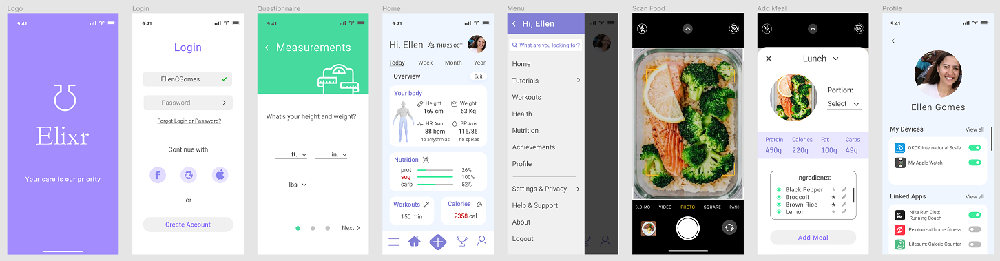

## About:
Academic project for first year software development students. 
Focused on the theme of health, each student must create an application from scratch, going through all the processes of building a system.

Development phases: Requirements Analysis, Database Modeling, Prototyping, Documentation, Creation, Implementation, Testing and Deployment.
## Status:
In Progress</img>
## [Prototyping](Prototyping.md)
Software: Figma

## Screens:

https://user-images.githubusercontent.com/78104233/188276656-d3ead191-d775-42ee-b23c-8b21596261be.mp4

